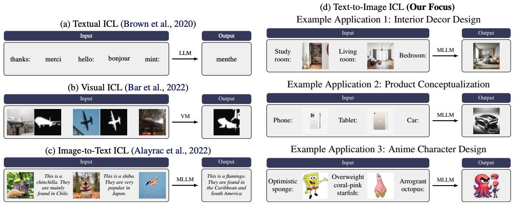
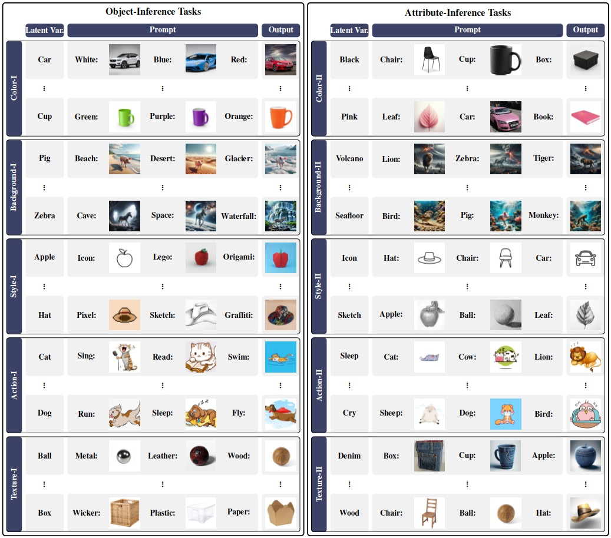
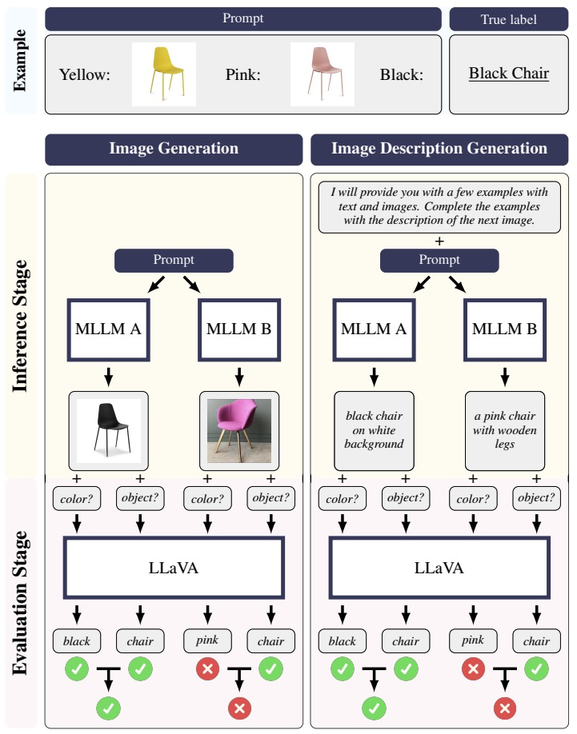

<h1 align="center"> <p>Can MLLMs Perform Multimodal In-Context Learning for Text-to-Image Generation?</p></h1>
<h4 align="center">
    <p>
      <a href="https://yzeng58.github.io/zyc_cv/" target="_blank">Yuchen Zeng</a><sup>*1</sup>, <a href="https://scholar.google.com/citations?user=Q-ARWkwAAAAJ&hl=eh" target="_blank">Wonjun Kang</a><sup>*2</sup>, <a href="https://bryce-chen.github.io/" target="_blank">Yicong Chen</a><sup>1</sup>, <a href="http://cvml.ajou.ac.kr/wiki/index.php/Professor" target="_blank">Hyung Il Koo</a><sup>2</sup>, <a href="https://kangwooklee.com/aboutme/" target="_blank">Kangwook Lee</a><sup>1</sup>
  </p>
  <p>
    <sup>1</sup>UW-Madison, <sup>2</sup> FuriosaAI
   </p>
    </h4>
<p align="center">
    <a href="https://github.com/UW-Madison-Lee-Lab/CoBSAT/releases">
        
    </a>
    <a href="https://arxiv.org/abs/2402.01293">
        
    </a>
    <a href="https://huggingface.co/datasets/yzeng58/CoBSAT">
        
    </a>
</p>

**Abstract**: The evolution from Large Language Models (LLMs) to Multimodal Large Language Models (MLLMs) has spurred research into extending In-Context Learning (ICL) to its multimodal counterpart. Existing such studies have primarily concentrated on image-to-text ICL. However, the Text-to-Image ICL (T2I-ICL), with its unique characteristics and potential applications, remains underexplored. To address this gap, we formally define the task of T2I-ICL and present CoBSAT, the first T2I-ICL benchmark dataset, encompassing ten tasks. Utilizing our dataset to benchmark six state-of-the-art MLLMs, we uncover considerable difficulties MLLMs encounter in solving T2I-ICL. We identify the primary challenges as the inherent complexity of multimodality and image generation. To overcome these challenges, we explore strategies like fine-tuning and Chain-of-Thought prompting, demonstrating notable improvements. Our code and dataset are available at <a href="https://github.com/UW-Madison-Lee-Lab/CoBSAT">this link</a>.



# News  🚀

* [07/10/24] Our paper is accepted by [COLM 2024](https://openreview.net/pdf?id=jt0R50d5nk)!
* [02/29/24] Our dataset is available on 🤗[huggingface](https://huggingface.co/datasets/yzeng58/CoBSAT)!
* [02/02/24] Our paper is available on <a href="https://arxiv.org/abs/2402.01293">arxiv</a>! 

# Contents

- [Step 1: Set Up Environment](#step-1-set-up-environment)
- [Step 2: Download Dataset](#step-2-download-dataset)
- [Step 3: Select MLLMs](#step-3-select-mllms)
  - [Supported Models](#supported-models)
  - [Feature Your Own Model](#feature-your-own-model)

- [Step 4: Benchmark MLLMs](#step-4-benchmark-mllms)
  - [[Optional] Fine-Tuning Stage](#optional-fine-tuning-stage)
  - [Inference Stage](#inference-stage)
  - [Evaluation Stage](#evaluation-stage)
- [Step 5: Cite Us](#step-5-cite-us)

# Step 1: Set Up Environment

To set up the environment for benchmarking MLLMs, please follow the following steps. This works for linux. 

1. Clone this repository and rename it as `cobsat`

   ```bash
   git clone --recurse-submodules https://github.com/UW-Madison-Lee-Lab/CoBSAT
   mv CoBSAT cobsat
   cd cobsat
   ```

2. Install Packages 

   <details><summary> Linux </summary>

   ```bash
   # create the environment that works for most of the cases
   conda create -n cobsat python=3.8.18
   conda activate cobsat
   pip install torch==2.1.2 torchvision==0.16.2 
   pip install -r conda_env/default_requirements.txt
   
   # create the environment for llava (used for evaluating the accuracy of the images) to work 
   conda create -n llava python=3.10.13
   conda activate llava
   pip install --upgrade pip  # enable PEP 660 support
   pip install git+https://github.com/yzeng58/LLaVA/@a61aae093656922fe16ec2152b031dd1de72fe92
   pip install conda_env/llava_requirements.txt
   ```

   </details>

   <details><summary> Mac </summary>
   TBA
   </details>

   <details><summary> Windows </summary>
   TBA
   </details>

3. Create `environment.py` in the `cobsat` directory. Note that many variables need you to config except `root_dir` on your own

   ```python
   # Configure the environment variables for the project
   
   import os
   root_dir = os.path.dirname(os.path.abspath(__file__))
   
   SEED_PROJECT_ROOT = f'{root_dir}/models/SEED'
   
   ###############
   # NEED UPDATE #
   ###############
   TRANSFORMER_CACHE = '/data/yzeng58/.cache/huggingface/hub' 
   
   #########################
   # NEED UPDATE IF NEEDED #
   #########################
   # GPT-4V
   OPENAI_API_KEY = { 
     'key1': f'{your_openai_key_1}',
     'key2': f'{your_openai_key_2}',
   }
   # Gemini
   GEMINI_API_KEY = {
     'key1': f'{your_gemini_key_1}',
     'key2': f'{your_gemini_key_2}',
   }
   # Claude
   CLAUDE_API_KEY = {
     'key1': f'{your_claude_key_1}',
     'key2': f'{your_claude_key_2}',
   }
   # Emu for Image Generation
   EMU_IMAGE_PATH = '/data/yzeng58/cobsat/models/Emu/Emu1/model_weights/Emu/pretrain' 
   # Emu-Instruct
   EMU_INSTRUCT_PATH = '/data/yzeng58/cobsat/models/Emu/Emu1/model_weights/Emu/Emu-instruct.pt' 
   # Emu-Generation
   EMU_TEXT_PATH = '/data/yzeng58/cobsat/models/Emu/Emu1/model_weights/Emu/Emu-pretrain.pt'
   # WANDB Logging https://wandb.ai/site
   WANDB_ENTITY = 'lee-lab-uw-madison'
   WANDB_PROJECT = 'cobsat'
   ```

# Step 2: Download Dataset



To use our dataset, please follow the following steps. 

1. Download the images and their corresponding descriptions of our dataset.

   ```bash
   wget "https://huggingface.co/datasets/yzeng58/CoBSAT/resolve/main/datasets.zip"
   ```
2. Uncompress the `datasets.zip` file via `unzip datasets.zip` and move the `datasets` folder into your `cobsat` folder. 

Up to now, the structure of your `cobsat` folder should look like this.

```
.
├── ...          
├── datasets                # download the dataset in this step
├── load_models
│   ├── call_emu.py
│   ├── call_emu2.py
│   ├── call_gill.py
│   ├── call_gpt.py
│   ├── call_llava.py       # LLaVA-1.5
│   ├── call_llava16.py     # LLaVA-NeXT 
│   ├── call_qwen.py
│   ├── call_seed.py
│   ├── call_gemini.py
│   ├── call_claude.py
│   ├── call_your_model.py  # [optional] create python file to load the model you want to evaluate
│   └── ... 
├── models                  
│   ├── SEED                
│   ├── gill                
│   ├── Emu                 
│   │   └── Emu1 
│   ├── LLaVA               
│   ├── Qwen-VL    
│   ├── Gemini
│   ├── Claude   
│   ├── OwnModel            # [optional] input your own model folder
│   └── ...
├── ...
├── environment.py          # follow the instruction above to create this file
├── load_model.py           # [optional] add your own model                
└── ...
```

# Step 3: Select MLLMs

We have implemented several state-of-the-art models for your convenience. Additionally, we offer guidelines for integrating your own MLLMs. 

## Supported Models

- [x] [SEED-LLaMA](https://arxiv.org/abs/2310.01218)
  * Image Generation
  * Text Generation
  * Fine-Tuning
- [x] [GILL](https://arxiv.org/abs/2305.17216)
  * Image Generation
  * Text Generation
- [x] [Emu](https://arxiv.org/abs/2307.05222)
  * Image Generation
  * Text Generation
- [x] [Emu2](https://arxiv.org/abs/2312.13286)
  * Image Generation
  * Text Generation
* [x] [GPT-4V]()
  * Text Generation
* [x] [LLaVA-1.5](https://arxiv.org/abs/2304.08485)
  * Text Generation
* [x] [LLaVA-1.6/LLaVA-NeXT](https://llava-vl.github.io/blog/2024-01-30-llava-next/)
  * Text Generation
* [x] [Qwen-VL](https://arxiv.org/abs/2308.12966)
  * Text Generation
  * Fine-Tuning
* [x] [Gemini](https://arxiv.org/abs/2312.11805)
  * Text Generation
* [x] [Claude](https://www.anthropic.com/claude)
  * Text Generation

## Feature Your Own Model

Throughout this section, the placeholder "OwnModel" can be substituted with the name of your specific model, such as "gpt4v".

1. Create your own model folder `OwnModel/` in `models/` if needed. Check [this](https://github.com/UW-Madison-Lee-Lab/CoBSAT/tree/master/models) for examples.

2. Create python file `call_OwnModel.py` in `load_models/` to load your own model.

   <details><summary> <code>call_OwnModel.py</code> template </summary>
    Your `call_OwnModel.py` script should include at least the following essential functions:

     - **`load_OwnModel`**: Utilized for loading the model to avoid repeated loading during inference or fine-tuning. In certain cases, this function may not be necessary. For example, OpenAI provides API access for GPT-4V, enabling inference without the need to explicitly load the model.
     - **`call_OwnModel`**: Employs the model to perform inference tasks.


   ```python
   # Template
   def load_OwnModel(
       device = 'cuda',
       seed = 123,
   ):
   		...
       return model, others
   ```

   You have the flexibility to define the input parameters and the format of the return values according to your needs.

   ```python
   # Template
   def call_OwnModel(
       text_inputs = ["Angry", "Cry", "Fly"],
       image_inputs = [
           "datasets/action_dog/angry_dog.jpg",
           "datasets/action_dog/cry_dog.jpg",
       ],
       seed = 123,
       gen_mode = 'text',
     	instruction = [
           "I will provide you with a few examples with text and images. Complete the example with the description of the next image. The description should be clear with main object, and include details such as color, texture, background, style, and action, if applicable. Tell me only the text prompt and I'll use your entire answer as a direct input to A Dalle-3. Never say other explanations. ",
           '',
       ],
     	call_mode = 'micl',
     	history = None,
     	save_history = False,
     	...
   ):
   		pass
       return output_dict
   ```

   * Necessary parameters for function `call_OwnModel`

     Below are the essential parameters required for configuring the model's operation.

     - **`call_mode`**: Specifies the operation mode with two options:
       - `micl`: Conducts text-to-image in-context learning (Multimodal In-Context Learning), combining `text_inputs` with `image_inputs` for model invocation.
       - `text`: Focuses solely on `text_inputs`, concatenating them for text-based processing.
     - **`text_inputs`**: A list of textual inputs used for demonstration and queries. Under `micl` mode, all but the last `text_inputs` are paired with `image_inputs` for in-context demonstrations. The final item is used as the textual query for model predictions.
     - **`image_inputs`**: A list of image inputs corresponding to `text_inputs` for multimodal demonstrations.
     - **`seed`**: An integer that sets the random seed, ensuring reproducibility of results.
     - **`gen_mode`**: Determines the type of output generated by the model:
       - `text`: Generates textual output.
       - `image`: Generate image output.
     - **`instruction`**: A list containing two strings designed to frame the prompt, with the first string placed at the beginning and the second at the end.
     - **`history`**: Tracks the history of previous prompts and model responses, aiding in multi-step reasoning. This parameter is optional (`None` by default). If utilized, the history should be integrated into new prompts.
     - **`save_history`**: Indicates whether to save the interaction history. This feature supports analyzing the model's learning and response patterns over time.

     Additional parameters may be used for customized usage. 

   * Return values for function `call_OwnModel`

     The function returns a dictionary comprising the following keys.

     - **`description`**: Contains the generated textual output as a string.
     - **`image`**: Holds the generated image output. This key is populated only when `gen_mode` is set to `image`.
     - **`history`**: If the `history` argument of the function is set to `True`, this key stores the interaction history, including both prompts and responses.

     Additional content may be stored in custom keys to suit specialized requirements.

   Check [`call_seed.py`](https://github.com/UW-Madison-Lee-Lab/CoBSAT/blob/master/load_models/call_seed.py#L106C5-L106C14) or other files in [`load_models/`](https://github.com/UW-Madison-Lee-Lab/CoBSAT/tree/master/load_models) for concrete examples. 

   </details>

3. Add your own model in [`load_model.py`](https://github.com/UW-Madison-Lee-Lab/CoBSAT/blob/master/load_model.py).

   <details><summary> <code>load_model.py</code> template </summary>

   ```python
       elif model == 'OwnModel':
           from load_models.call_OwnModel import load_OwnModel, call_OwnModel
   				... 
           return lambda configs: call_OwnModel(
               model, 
               others, 
               gen_mode = gen_mode, 
               **configs
           )
   ```

   You can check our implementation for other models for example. For your own model, typically you need to load the model first, and then use `call_OwnModel` to make the infernece. You may want to fix some parameters which are not related to the prompts such as `model` or `tokenizer` in [this example](https://github.com/UW-Madison-Lee-Lab/CoBSAT/blob/master/load_model.py#L87). Here is one example usage:

   ```python
   >>> from load_model import load_model
   >>> call_model = load_model('qwen')
   
   The model is automatically converting to bf16 for faster inference. If you want to disable the automatic precision, please manually add bf16/fp16/fp32=True to "AutoModelForCausalLM.from_pretrained".
   Loading checkpoint shards: 100%|██████████| 10/10 [00:12<00:00,  1.21s/it]
   
   >>> call_model({
       'text_inputs': ["Red", "Green", 'Yellow'],
       'image_inputs': [
           "/data/yzeng58/micl/datasets/color_bag/red_bag.jpg",
           "/data/yzeng58/micl/datasets/color_bag/green_bag.jpg",
       ],
       'seed': 123,
   })
      
   {'description': 'The next image should be a yellow school bus on a white background, with the words "The Ultimate School Bus" in black font and "For all your school needs" in yellow font on the front. The bus should be a 3D model and the background should be a white field.',
    'time': 2.4913034439086914}
   ```

   </details>

4. Add your model to `supported_models` in `configs.py`.

   ```python
   supported_models = [
       'qwen', 
       'llava', 
       'llava16',
       'gpt4v', 
       'emu2', 
       'emu', 
       'seed',
       'gill',
       'gemini',
       'claude',
       'OwnModel', # your own model
   ]
   ```

5. Config the default instruction of your model by updating `instruction_dict` in [`configs.py`](https://github.com/UW-Madison-Lee-Lab/CoBSAT/blob/master/configs.py).

   Especially, you need to edit the `instruction_dict['default']`.

   If your model support image generation, then you need to edit `instruction_dict['default']['image']` .

   ```python
   'image': {
       'gill': (
           'You are a professional assistant can generate a new image based on the seqeunce. ',
           '',
       ),
       ...
       # NEED UPDATE
       'OwnModel': (
           'Based on the sequence, generate the next image.',
           'Make the prediction now.'
       )
   }
   ```

   If your model support text generation, then you need to edit `instruction_dict['default']['text']` .

   ```python
   'text': {
       'seed': (
           "I will provide you a few examples with text and image. Complete the example with the description of next image. Tell me only the text prompt and I'll use your entire answer as a direct input to A Dalle-3. Never say other explanations. ",
           '',
       ),
       ...
       # NEED UPDATE
       'OwnModel': (
           'Based on the sequence, describe the next image clearly, including details such as the main object, color, texture, background, action, style, if applicable. ',
           'Make the prediction now.'
       )
   }
   ```

6. [Optional: If you want to finetune your model on our dataset] Update [`finetune_icl.py`](https://github.com/UW-Madison-Lee-Lab/CoBSAT/blob/master/finetune_icl.py)

   Please refer to the current example of fine-tuning Qwen-VL in [here](https://github.com/UW-Madison-Lee-Lab/CoBSAT/blob/master/finetune_icl.py#L39).

# Step 4: Benchmark MLLMs



## [Optional] Fine-Tuning Stage

```bash
# Example
# activate the default environment
conda activate micl

python finetune_icl.py \
--model qwen \
--shot 2 \ 							
--prompt_type default \
--gen_mode text			
```

<details><summary> Parameter Descriptions </summary>

  - **`model`**: Specifies the model for fine-tuning. Currently, only `qwen` (Qwen-VL) is supported.For integrating your own model, refer to the section [Feature Your Own Model](#optional-feature-your-own-model).
  - **`shot`**: Defines the number of demonstration examples included in each training prompt.
  - **`prompt_type`**: Selects the type of prompt to use. Available options include:
    - `default`: The standard prompt design as described in our paper.
    - `misleading`: Introduces misleading information in the textual input of each demonstration, as detailed in the appendix.
    - `cot` (Chain of Thought): Incorporates multi-step inference prompts, prompting the model to generate reasoning steps ("let's think step by step") before the final output.
    - `exact`: Directly provides the ground truth label as the textual input.
    - `caption`: Replaces images in the prompt with their corresponding captions.
    - `instruct`: Adds an additional sentence explicitly stating the relationship between textual input and visual output in each demonstration.
  - **`gen_mode`**: Determines the output mode of the model, with two options:
    - `image`: The model generates an image output.
    - `text`: The model generates textual descriptions for the next image.


</details>

The fine-tuned models will be stored in `ft_models/`.

## Inference Stage

```bash
# Example

# activate the default environment
# if the model is LLaVA, replace `micl` with `llava`
conda activate micl

python inference_icl.py \
--model seed \
--prompt_type default \
--gen_mode image \
--shot 2 4 \
--seed 123 \
--device cuda \
--task_id 1 2 3 \
--overwrite 0 \
--finetuned_model 0 \
--data_mode default
```

<details><summary> Parameter Descriptions </summary>

- **`model`**: Specifies the model for making the inference. The supported models include `seed` (SEED-LLaMA), `gill` (GILL), `emu`  (Emu), `emu2` (Emu2), `gpt4v` (GPT-4V), `llava` (LLaVA-1.5), `llava16` (LLaVA-1.6/LLaVA-NeXT), `gemini` (Gemini), `claude` (Claude) and `qwen` (Qwen-VL).  
- **`shot`**: Defines the number of demonstration examples included in each training prompt.
- **`prompt_type`**: Selects the type of prompt to use. Available options include:
  * `default`: The standard prompt design as described in our paper.
  * `misleading`: Introduces misleading information in the textual input of each demonstration, as detailed in the appendix.
  * `cot` (Chain of Thought): Incorporates multi-step inference prompts, prompting the model to generate reasoning steps ("let's think step by step") before the final output.
  * `exact`: Directly provides the ground truth label as the textual input.
  * `caption`: Replaces images in the prompt with their corresponding captions.
  * `instruct`: Adds an additional sentence explicitly stating the relationship between textual input and visual output in each demonstration.
- **`gen_mode`**: Determines the output mode of the model, with two options:
  * `image`: The model generates an image output.
  * `text`: The model generates textual descriptions for the next image.
- **`seed`**: An integer used to set the random seed for reproducibility.
- **`device`**: Specifies the computing device for the experiments. The default value is `cuda`, which utilizes a single GPU.
- **`task_id`**: Identifies the task being performed. By default, all ten tasks are executed. Detailed information about each task can be found in `configs.py` under the definition of `task_dataframe`, as well as in our paper.
- **`overwrite`**: Determines whether to reuse existing results or overwrite them. This is applicable when results have already been saved.
- **`finetuned_model`**: Indicates whether to use a finetuned model. If enabled, the finetuned model must be stored beforehand by executing `finetune_icl.py`, and the `data_mode` should be set to `ft_test`. 
- **`data_mode`**: Offers two options: `default` and `ft_test`. In `ft_test` mode, the dataset is divided into training and testing sets, with only the testing set being utilized.

</details>

The generated outputs will be stored in `results/exps/` by default or `results/ft` if `finetuned_model` is set to `True`.

## Evaluation Stage

```bash
# Example
# activate the environment for using LLaVA (since LLaVA is our evaluation model)
conda activate llava

python evaluation_icl.py \
--model seed \
--prompt_type default \
--eval_mode image \
--task_id 1 2 3 \
--shot 2 4 \
--device cuda \
--seed 123 \
--wandb 1 \
--overwrite 0 \
--finetuned_model 0 \
--data_mode default
```

<details><summary> Parameter Descriptions </summary>

- **`model`**: Specifies the model for making the inference. The supported models include `seed` (SEED-LLaMA), `gill` (GILL), `emu`  (Emu), `emu2` (Emu2), `gpt4v` (GPT-4V), `llava` (LLaVA-1.5), `llava16` (LLaVA-1.6/LLaVA-NeXT), `gemini` (Gemini), `claude` (Claude) and `qwen` (Qwen-VL).  
- **`shot`**: Defines the number of demonstration examples included in each training prompt.
- **`prompt_type`**: Selects the type of prompt to use. Available options include:
  - `default`: The standard prompt design as described in our paper.
  - `misleading`: Introduces misleading information in the textual input of each demonstration, as detailed in the appendix.
  - `cot` (Chain of Thought): Incorporates multi-step inference prompts, prompting the model to generate reasoning steps ("let's think step by step") before the final output.
  - `exact`: Directly provides the ground truth label as the textual input.
  - `caption`: Replaces images in the prompt with their corresponding captions.
  - `instruct`: Adds an additional sentence explicitly stating the relationship between textual input and visual output in each demonstration.
- **`eval_mode`**: Specifies the type of model output to be evaluated. Available options are:
  - `image`: Evaluates the image output generated by the model.
  - `text`: Evaluates the textual descriptions for the subsequent image as generated by the model.
- **`seed`**: An integer used to set the random seed for reproducibility.
- **`device`**: Specifies the computing device for the experiments. The default value is `cuda`, which utilizes a single GPU.
- **`task_id`**: Identifies the task being performed. By default, all ten tasks are executed. Detailed information about each task can be found in `configs.py` under the definition of `task_dataframe`, as well as in our paper.
- **`overwrite`**: Determines whether to reuse existing results or overwrite them. This is applicable when results have already been saved.
- **`finetuned_model`**: Indicates whether to use a finetuned model. If enabled, the finetuned model must be stored beforehand by executing `finetune_icl.py`.
- **`data_mode`**: Offers two options: `default` and `ft_test`. In `ft_test` mode, the dataset is divided into training and testing sets, with only the testing set being utilized.

</details>

The evaluation results will be stored in `results/evals/` by default or `results/ft` if `finetuned_model` is set to `True`. If `wandb` is `True`, you can also view the evaluation results in your wandb board. 

# Step 5: Cite Us

```tex
@article{zeng2024can,
  title={Can MLLMs Perform Text-to-Image In-Context Learning?},
  author={Zeng, Yuchen and Kang, Wonjun and Chen, Yicong and Koo, Hyung Il and Lee, Kangwook},
  journal={arXiv preprint arXiv:2402.01293},
  year={2024}
}
```

