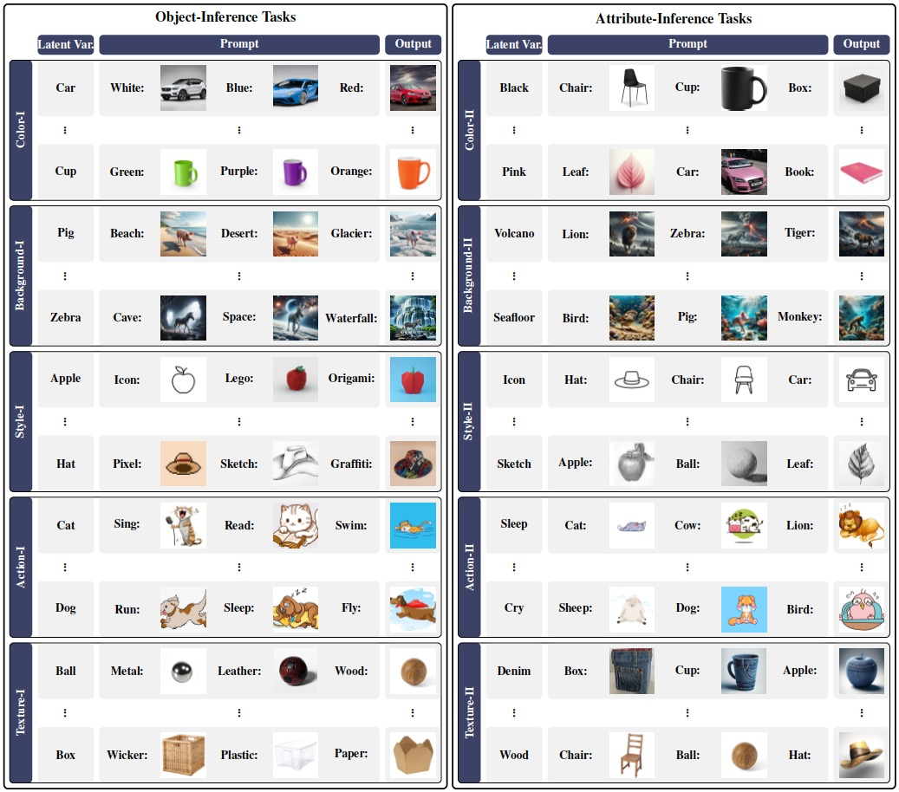

<h1 align="center"> <p>Can MLLMs Perform Multimodal In-Context Learning for Text-to-Image Generation?</p></h1>
<h4 align="center">
    <p>
      <a href="https://yzeng58.github.io/zyc_cv/" target="_blank">Yuchen Zeng</a><sup>*1</sup>, <a href="https://scholar.google.com/citations?user=Q-ARWkwAAAAJ&hl=eh" target="_blank">Wonjun Kang*</a><sup>*2</sup>, <a href="https://bryce-chen.github.io/" target="_blank">Yicong Chen</a><sup>1</sup>, <a href="http://cvml.ajou.ac.kr/wiki/index.php/Professor" target="_blank">Hyung Il Koo</a><sup>2</sup>, <a href="https://kangwooklee.com/aboutme/" target="_blank">Kangwook Lee</a><sup>1</sup>
  </p>
  <p>
    <sup>1</sup>UW-Madison, <sup>2</sup> FuriosaAI
   </p>
    </h4>
**Paper Link**: https://arxiv.org/abs/2402.01293

**Abstract**: The evolution from Large Language Models (LLMs) to Multimodal Large Language Models (MLLMs) has spurred research into extending In-Context Learning (ICL) to its multimodal counterpart. Existing such studies have primarily concentrated on image-to-text ICL. However, the Text-to-Image ICL (T2I-ICL), with its unique characteristics and potential applications, remains underexplored. To address this gap, we formally define the task of T2I-ICL and present CoBSAT, the first T2I-ICL benchmark dataset, encompassing ten tasks. Utilizing our dataset to benchmark six state-of-the-art MLLMs, we uncover considerable difficulties MLLMs encounter in solving T2I-ICL. We identify the primary challenges as the inherent complexity of multimodality and image generation. To overcome these challenges, we explore strategies like fine-tuning and Chain-of-Thought prompting, demonstrating notable improvements. Our code and dataset are available at <a href="https://github.com/UW-Madison-Lee-Lab/CoBSAT">this link</a>.

# News  🚀

* TODO: Our dataset will be available on huggingface! 
* [02/02/24] Our paper is available on <a href="https://arxiv.org/abs/2402.01293">arxiv</a>! 

Stay tuned for the updates!

# Contents

- [Step 1: Set Up Environment](#step-1-set-up-environment)
- [Step 2: Download Dataset](#step-2-download-dataset)
- [Step 3: Benchmark MLLMs' M-ICL Text-to-Image Capability](#step-3-benchmark-mllms)

# Step 1: Set Up Environment

To set up the environment for benchmarking MLLMs, please follow the following steps. This works for linux. 

1. Clone this repository and rename it as `cobsat`

   ```bash
   git clone --recurse-submodules https://github.com/UW-Madison-Lee-Lab/CoBSAT
   mv CoBSAT cobsat
   cd cobsat
   ```

2. Install Packages 

   <details><summary> Linux </summary>

   ```bash
   # create the environment that works for most of the cases
   conda create -n cobsat python=3.8.18
   conda activate cobsat
   pip install torch==2.1.2 torchvision==0.16.2 
   pip install -r conda_env/default_requirements.txt
   
   # create the environment for llava (used for evaluating the accuracy of the images) to work 
   conda create -n llava python=3.10.13
   conda activate llava
   pip install --upgrade pip  # enable PEP 660 support
   pip install git+https://github.com/yzeng58/LLaVA/@a61aae093656922fe16ec2152b031dd1de72fe92
   pip install conda_env/llava_requirements.txt
   ```

   </details>

   <details><summary> Mac </summary>

   </details>

   <details><summary> Windows </summary>
   </details>

3. Create `environment.py` in the `cobsat` directory. Note that many variables need you to config except `root_dir` on your own

   ```python
   # Configure the environment variables for the project
   
   import os
   root_dir = os.path.dirname(os.path.abspath(__file__))
   
   SEED_PROJECT_ROOT = f'{root_dir}/models/SEED'
   
   ###############
   # NEED UPDATE #
   ###############
   TRANSFORMER_CACHE = '/data/yzeng58/.cache/huggingface/hub' 
   
   #########################
   # NEED UPDATE IF NEEDED #
   #########################
   # GPT-4V
   OPENAI_API_KEY = f'{your_openai_key}'
   # Emu for Image Generation
   EMU_IMAGE_PATH = '/data/yzeng58/cobsat/models/Emu/Emu1/model_weights/Emu/pretrain' 
   # Emu-Instruct
   EMU_INSTRUCT_PATH = '/data/yzeng58/cobsat/models/Emu/Emu1/model_weights/Emu/Emu-instruct.pt' 
   # Emu-Generation
   EMU_TEXT_PATH = '/data/yzeng58/cobsat/models/Emu/Emu1/model_weights/Emu/Emu-pretrain.pt'
   # WANDB Logging https://wandb.ai/site
   WANDB_ENTITY = 'lee-lab-uw-madison'
   WANDB_PROJECT = 'cobsat'
   ```

# Step 2: Download Dataset



To use our dataset, please follow the following steps. 

1. Download the images and their corresponding descriptions of our dataset from this [link](https://drive.google.com/file/d/1Yk8mo_xD95GEcee3EsA1qtJTsx1p1DNJ/view?usp=sharing).
2. Untar the `.tar.gz` file via `tar -xvf datasets.tar.gz` and extract the `datasets` folder into your `cobsat` folder. 

Up to now, the structure of your `cobsat` folder should look like this.

```
.
├── ...          
├── datasets                # download the dataset in this step
├── load_models
│   ├── call_emu.py
│		├── call_gill.py
│		├── call_gpt.py
│		├── call_llava.py
│		├── call_qwen.py
│		├── call_seed.py
│   ├── call_your_model.py  # [optional] create python file to load the model you want to evaluate
│   └── ... 
├── models                  
│   ├── SEED                # [optional] git clone https://github.com/AILab-CVC/SEED
│   ├── gill                # [optional] git clone https://github.com/kohjingyu/gill
│   ├── Emu                 # [optional] git clone https://github.com/baaivision/Emu
│   │   └── Emu1 
│   ├── LLaVA               # [optional] git clone https://github.com/haotian-liu/LLaVA
│   ├── Qwen-VL             # [optional] git clone https://github.com/QwenLM/Qwen-VL
│   ├── OwnModel            # [optional] input your own model folder
│   └── ...
├── ...
├── environment.py          # follow the instruction above to create this file
├── load_model.py           # [optional] add your own model                
└── ...
```

# Step 3: Benchmark MLLMs

### Already Supported Models

- [x] [SEED-LLaMA](https://arxiv.org/abs/2310.01218)
  * Image Generation
  * Text Generation
- [x] [GILL](https://arxiv.org/abs/2305.17216)
  * Image Generation
  * Text Generation
- [x] [Emu](https://arxiv.org/abs/2307.05222)
  * Image Generation
  * Text Generation

- [x] [GPT-4V]()
  * Text Generation
- [x] [LLaVA](https://arxiv.org/abs/2304.08485)
  * Text Generation
- [x] [Qwen-VL](https://arxiv.org/abs/2308.12966)
  * Text Generation
  * Fine-Tuning

### [Optional] Feature Your Own Model

1. Create your own model folder `OwnModel/` in `models/` if needed.

2. Create python file `call_OwnModel.py` in `load_models/` to load your own model.

   <details><summary> <code>call_OwnModel.py</code> template </summary>

   ```
   def load_OwnModel(
       device = 'cuda',
       seed = 123,
   ):
   
       return model, others
   ```

   ```
   def call_OwnModel(
       model, 
       others,
       text_inputs = ["Red", "Green", "Yellow"],
       image_inputs = [
           "/data/yzeng58/cobsat/datasets/weather_pig/aurora_pig.jpg",
           "/data/yzeng58/cobsat/datasets/weather_pig/hailstorm_pig.jpg"
       ],
       seed = 123,
       gen_mode = 'text',
   ):
   
       output_dict = {}
       OwnModel_start = time()
   
       if gen_mode == 'image':
   
       elif gen_mode == 'text':
   
       OwnModel_end = time()
       output_dict['time'] = OwnModel_end - OwnModel_start
   
       return output_dict
   ```

   </details>

3. Add your own model in `load_model.py`.

   <details><summary> <code>load_model.py</code> template </summary>

   ```python
       elif model == 'OwnModel':
           from load_models.call_OwnModel import load_OwnModel, call_OwnModel
   
           model, others = load_OwnModel(device=device)
           call_OwnModel(
               model, 
               others,
               text_inputs = ['Yellow', 'White', 'Black'],
               image_inputs= [
                   f"{root_dir}/models/Emu/Emu2/examples/dog2.jpg",
                   f"{root_dir}/models/Emu/Emu2/examples/dog3.jpg"
               ],
               seed = 123,
               gen_mode = gen_mode,
           )
           return lambda configs: call_OwnModel(
               model, 
               others, 
               gen_mode = gen_mode, 
               **configs
           )
   ```

   </details>

4. Add your model to `supported_models` in `configs.py`.

   ```python
   supported_models = [
       'qwen', 
       'llava', 
       'gpt4v', 
       'emu2', 
       'emu', 
       'seed',
       'gill',
       'OwnModel', # your own model
   ]
   ```

5. Config the default instruction of your model by updating `instruction_dict` in `configs.py`.

   Especially, you need to edit the `instruction_dict['default']`.

   If your model support image generation, then you need to edit `instruction_dict['default']['image']` .

   ```python
   'image': {
       'gill': (
           'You are a professional assistant can generate a new image based on the seqeunce. ',
           '',
       ),
       ...
       # NEED UPDATE
       'OwnModel': (
           'Based on the sequence, generate the next image.',
           'Make the prediction now.'
       )
   }
   ```

   If your model support text generation, then you need to edit `instruction_dict['default']['text']` .

   ```python
   'text': {
       'seed': (
           "I will provide you a few examples with text and image. Complete the example with the description of next image. Tell me only the text prompt and I'll use your entire answer as a direct input to A Dalle-3. Never say other explanations. ",
           '',
       ),
       ...
       # NEED UPDATE
       'OwnModel': (
           'Based on the sequence, describe the next image clearly, including details such as the main object, color, texture, background, action, style, if applicable. ',
           'Make the prediction now.'
       )
   }
   ```

6. [Optional: If you want to finetune your model on our dataset] 

​	TBA

### Evaluate MLLMs on Our Dataset

* [Optional] Fine-tuning

  ```bash
  # Example
  python finetune_icl.py \
  --model qwen \
  --shot 2 \ 							
  --prompt_type default \
  --gen_mode text			
  ```

  <details><summary> Parameter Descriptions </summary>
  * **`model`**: Specifies the model for fine-tuning. Currently, only `qwen` (Qwen-VL) is supported.For integrating your own model, refer to the section [Feature Your Own Model](#optional-feature-your-own-model).
  * **`shot`**: Defines the number of demonstration examples included in each training prompt.
  * **`prompt_type`**: Selects the type of prompt to use. Available options include:
    * `default`: The standard prompt design as described in our paper.
    * `misleading`: Introduces misleading information in the textual input of each demonstration, as detailed in the appendix.
    * `cot` (Chain of Thought): Incorporates multi-step inference prompts, prompting the model to generate reasoning steps ("let's think step by step") before the final output.
    * `exact`: Directly provides the ground truth label as the textual input.
    * `caption`: Replaces images in the prompt with their corresponding captions.
    * `instruct`: Adds an additional sentence explicitly stating the relationship between textual input and visual output in each demonstration.

  * **`gen_mode`**: Determines the output mode of the model, with two options:
    * `image`: The model generates an image output.
    * `text`: The model generates textual descriptions for the next image.


  </details>

* Stage 1: Output Generation

  ```bash
  # Example
  python inference_icl.py \
  --model seed \
  --prompt_type default \
  --gen_mode image \
  --shot 2 4 \
  --seed 123 \
  --device cuda \
  --task_id 1 2 3 \
  --overwrite 0 \
  --finetuned_model 0 \
  --data_mode default
  ```

  <details><summary> Parameter Descriptions </summary>

  * **`model`**: Specifies the model for making the inference. The supported models include `seed` (SEED-LLaMA), `gill` (GILL), `emu`  (Emu), `gpt4v` (GPT-4V), `llava` (LLaVA), and `qwen` (Qwen-VL).  
  * **`shot`**: Defines the number of demonstration examples included in each training prompt.
  * **`prompt_type`**: Selects the type of prompt to use. Available options include:
    * `default`: The standard prompt design as described in our paper.
    * `misleading`: Introduces misleading information in the textual input of each demonstration, as detailed in the appendix.
    * `cot` (Chain of Thought): Incorporates multi-step inference prompts, prompting the model to generate reasoning steps ("let's think step by step") before the final output.
    * `exact`: Directly provides the ground truth label as the textual input.
    * `caption`: Replaces images in the prompt with their corresponding captions.
    * `instruct`: Adds an additional sentence explicitly stating the relationship between textual input and visual output in each demonstration.
  * **`gen_mode`**: Determines the output mode of the model, with two options:
    * `image`: The model generates an image output.
    * `text`: The model generates textual descriptions for the next image.
  * **`seed`**: An integer used to set the random seed for reproducibility.
  * **`device`**: Specifies the computing device for the experiments. The default value is `cuda`, which utilizes a single GPU.
  * **`task_id`**: Identifies the task being performed. By default, all ten tasks are executed. Detailed information about each task can be found in `configs.py` under the definition of `task_dataframe`, as well as in our paper.
  * **`overwrite`**: Determines whether to reuse existing results or overwrite them. This is applicable when results have already been saved.
  * **`finetuned_model`**: Indicates whether to use a finetuned model. If enabled, the finetuned model must be stored beforehand by executing `finetune_icl.py`.
  * **`data_mode`**: Offers two options: `default` and `ft_test`. In `ft_test` mode, the dataset is divided into training and testing sets, with only the testing set being utilized.

  </details>

* Stage 2: Evaluation

  ```bash
  # Example
  python evaluation_icl.py \
  --model seed \
  --prompt_type default \
  --eval_mode image \
  --task_id 1 2 3 \
  --shot 2 4 \
  --device cuda \
  --seed 123 \
  --wandb 1 \
  --overwrite 0 \
  --finetuned_model 0 \
  --data_mode default
  ```

<details><summary> Parameter Descriptions </summary>
* **`model`**: Specifies the model for making the inference. The supported models include `seed` (SEED-LLaMA), `gill` (GILL), `emu`  (Emu), `gpt4v` (GPT-4V), `llava` (LLaVA), and `qwen` (Qwen-VL).  
* **`shot`**: Defines the number of demonstration examples included in each training prompt.
* **`prompt_type`**: Selects the type of prompt to use. Available options include:
  * `default`: The standard prompt design as described in our paper.
  * `misleading`: Introduces misleading information in the textual input of each demonstration, as detailed in the appendix.
  * `cot` (Chain of Thought): Incorporates multi-step inference prompts, prompting the model to generate reasoning steps ("let's think step by step") before the final output.
  * `exact`: Directly provides the ground truth label as the textual input.
  * `caption`: Replaces images in the prompt with their corresponding captions.
  * `instruct`: Adds an additional sentence explicitly stating the relationship between textual input and visual output in each demonstration.
* **`eval_mode`**: determine which type of output of the model to evaluate, with two options:
  * `image`: image output generated by model.
  * `text`: textual descriptions for the next image generated by the model.
* **`seed`**: An integer used to set the random seed for reproducibility.
* **`device`**: Specifies the computing device for the experiments. The default value is `cuda`, which utilizes a single GPU.
* **`task_id`**: Identifies the task being performed. By default, all ten tasks are executed. Detailed information about each task can be found in `configs.py` under the definition of `task_dataframe`, as well as in our paper.
* **`overwrite`**: Determines whether to reuse existing results or overwrite them. This is applicable when results have already been saved.
* **`finetuned_model`**: Indicates whether to use a finetuned model. If enabled, the finetuned model must be stored beforehand by executing `finetune_icl.py`.
* **`data_mode`**: Offers two options: `default` and `ft_test`. In `ft_test` mode, the dataset is divided into training and testing sets, with only the testing set being utilized.

</details>

### Description of Parameters

TBA

## Citation

TBA
